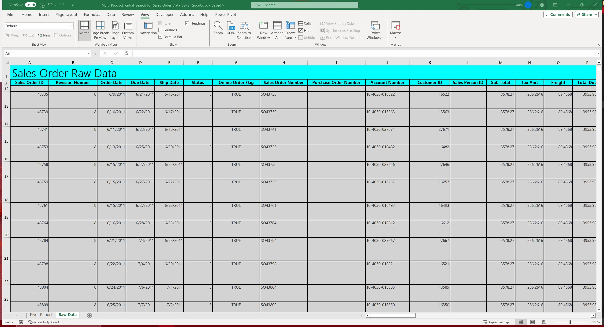

# 1. SQL Server & SSRS Sales Report Project
Important notes: This project requires you to install software on your computer if you want run the reports yourself. It is not necessary to install anything in order to understand this project becuase this README document will explain everything. 


# 2. Business Case
> ## a. Business Overview
> AdventureWorks is medium sized business that sells bikes, bike parts, and bike accessories across the United States. They sell directly to customers and to bike retailers.
> ## b. Scenario Overview
>  I have been hired as a data analyst at AdventureWorks to improve the reporting processes for more junior level business analysts, data analysts, executives, and other stakeholders across the business. AdventureWorks is growing fast and needs help improving the reporting processes across the company.
> ## c. Project Objective
> The objective of this report is to allow for analysts, sales managers, and salespeople to be able to pull Sales Order, Product, ShipTo Location, and BillTo Location information from the AdventureWorks2019 database into 1 table without having to know how to use SQL. That way the end user of the report can use pivot tables to quickly analyze accurate Sales Order Data to help the business make better decisions.
> ## d. Project Requirements
> 1. Use SSRS as the primary reporting tool so that the end users can export the data that they need.
> 2. Include the following parameters in the report so that the end users can filter the data:
>> * This grouping of parameter(s) will have the wildcard symbol(%) as the default value. This will allow the end user to do 3 things. If you leave the parameter blank, all possible values will return. You can also select multiple valid values. Lastly, it will allow the end user to use wildcard characters(%) to select partial results. For example, if the user enters (BA%,BB%,BE%,BK-R93R-62,FR-\_\_\_\_-60,%-1000,%-[4-5][0-2]), the first 3 values (BA%,BB%,BE%) have the wildcard symbol so all possible items starting with BA, BB, and BE would be returned. The next value in the selection (BK-R93R-62) is just an item number so only that item will be returned. (FR-\_\_\_\_-60) will return all items the begin with FR, have any 4 characters in the middle, & end with -60. (%-1000) will return any products that end with -1000. (%-[4-5][0-2]) will return any products that end with - as the 1st character, 4 or 5 as the 2nd character, & 0,1,or 2 as the 3rd character. Note: If you delete the default value(%) and fail to replace it with a valid value and the report will return a no results because it would be filtering for an invalid condition.
>>> 1. Product Number Par
>> * This grouping of parameter(s) require the user to input date values and cannot be blank. They should have default values of 05/31/2011 for the Start Date and 06/30/2014 for the end date becuase there is no data outside of that date range. The defualt values should return the MIN and MAX order dates for the start and end date parameters.
>>> 1. Start Date
>>> 1. End Date
>> * This grouping of parameter(s) will allow the end user to do 2 things.  If you leave the parameter blank, all possible values will return. You can also select a single valid value for each of these parameters to filter down the results further. Wildcard searches will not work.
>>> 1. Product Subcategory
>>> 1. Product Category
>>> 1. CustomerID
>> * This grouping of parameter(s) will also have the wildcard symbol(%) as the default value. This will allow the end user to do 3 things. If you leave the parameter with the default value (%), all possible values will return. You can only enter a single valid value for each of these parameters to filter down the results further but you can use wildcard characters(%) to select partial results if you choose to. Note: If you delete the default value(%) and fail to replace it with a valid value and the report will return a no results because it would be filtering for an invalid condition.
>>> 1. Ship To Address
>>> 1. Ship To Postal Code
>>> 1. Ship To Location Type
>>> 1. Bill To Address
>>> 1. Bill To Postal Code
>>> 1. Bill To Location Type
> 3. Use an embedded data source connection to connect the AdventureWorks2019 database.
> 4. Use a stored procedure that also can be executed using Sql Server Management Studio as the SSRS Report Dataset. This will ensure that the SQL logic isn't stored in the .rdl file and allow for future reports to be able to use that same SQL logic.
> 5. Create a SQL query with variables that mimics the stored procedure so that analysts with read only SQL access to the AdventureWorks2019 database can understand the logic of the stored procedure in a step by step manner. The query should return a results window in SSMS for each of the steps in the process so that other analysts can get an idea of how the stored procedure works.
# 3. Project Steps
## a. Dig through the AdventureWorks2019 database and learn how the data is structured and organized.

<details>
<summary>Sales Schema Overview</summary>


The entities in the Sales Schema revolve around the  Sales Order Header and Sales Order Detail Tables. These are the main fact tables that show the company's sales order information. The rest of the tables in the Sales Schema can connect to these 2 tables via various foreign keys to give additional information about the sales orders.
</details>

<details>
<summary>Person Schema Overview</summary>


Many of the entities in the person schema are given a [Business Entitiy ID] as a primary key on many different tables instead of each table having seperate an unique primary keys. For example, the different categories (types) of people, address locations use the [Business Entitiy ID] as to connect other tables in different schemas instaed of having a Person ID & Address ID. [Business Entitiy ID] is actually a foreign key on many different fields for the Sales Order Header and Sales Order Detail Tables in the Sales Schema. This will allow me to connect Bill To and Ship To Location information to Sales Order information.
</details>

<details>
<summary>Production Schema Overview</summary>


The entities in the production schema revolve around the Product table which conations (product/item) information. The tables in this schema will allow me to add additional product information to the Sales Order Detail Table in the Sales Schema via the [Product ID] primary/foreign key.

</details>

## b. Create the Stored Procedure and it's parameters.
<details>
<summary>Stored Procedure + Parameters Code Snippet</summary>

```sql

/*
Create Stored Procedure and it's parameters
*/

Create or Alter Proc dbo.[Multi Product Partial Product Search on Sales Order Data SP]
	/*
	Can contain a multiple vales seperated by a comma within the same string
	Those values can be exact values or partial values with wildcard characters to allow for exact and partial matches
	If the string is blank, it will return all possible values
	*/
	@ProductNumberPar as varchar (max)

	--Must be exact and can't be empty.
	,@StartDate as datetime
	,@EndDate as datetime

	--Exact search or can be empty
	,@ProductSubcategory as varchar(30)
	,@ProductCategory as varchar(30)
	,@CustomerID as varchar(30)

	/*
	Searchable (% wildcard) and can either contain only a (%), a (%) with a partial string, or an exact search.
	Must not be blank
	*/
	,@ShipToAddress as varchar(30)
	,@ShipToPostalCode as varchar(30)
	,@ShipToLocationType as varchar(30)
	,@BillToAddress as varchar(30)
	,@BillToPostalCode as varchar(30)
	,@BillToLocationType as varchar(30)

as

---------------------------------------------------------------------------------------------------------------------

```

</details>

## c. Create script that allows user to input any combination of item numbers with and without wildcard characters and returns all matching items from the database.
Script Overview
Note: There are a lot of commented sections of code left in the scripts that if you were to uncomment, would return values that are used for debugging the script. The names of the queries should tell you what is specifically being returned.

<details>
<summary>Wildcard Products Code Snippet</summary>

```sql


---------------------------------------------------------------------------------------------------------------------


CREATE TABLE #ProductNumber ([Product #] VARCHAR(MAX))


 /*
 Inserting each comma seperated value into a temp table except for the last Product in the CSV
 */

  WHILE CHARINDEX(',',@ProductNumberPar) <> 0 
  BEGIN
		/*Takes the Parameter String of CSV(s) & inserts the left most Product during each iteration*/
    INSERT INTO #ProductNumber VALUES((SELECT LEFT(@ProductNumberPar, CHARINDEX(',',@ProductNumberPar)-1)))
		/*Takes the Parameter String of CSV(s) & eliminated the left most Product during each iteration*/
    SET @ProductNumberPar = (SELECT RIGHT(@ProductNumberPar,LEN(@ProductNumberPar)-CHARINDEX(',',@ProductNumberPar)))
  END


 /*Inserts the last CSV value into the Temp Table*/
 insert into #ProductNumber values ((select @ProductNumberPar))


-------------------------------------------------------------------------------------------------------------------------- 


/* 
Assigns an index number to each partial Product number so that each wildcard Product index will
correspond to a counter value for the loop below.
*/
select 
ROW_NUMBER() over(order by #ProductNumber.[Product #]) as [Primary Key]
,#ProductNumber.[Product #] as [ProductNumber]
into #ProductNumberWithPK
from #ProductNumber


-------------------------------------------------------------------------------------------------------------------------------------------------------


create table #ProductNumberWildcardLoop (ProductNumber varchar (max) )


declare @Counter int
declare @NumOfProducts int
declare @SelectedProduct varchar(20)

set @Counter = 1
set @NumOfProducts = (select COUNT(*) from #ProductNumberWithPK)

/*
For each indexed partial Product string in #ProductNumberWithPK,
insert into #ProductNumberWildcardLoop all Products that contain each partial Product.
*/

while @Counter <= @NumOfProducts
	begin
		set @SelectedProduct = (select #ProductNumberWithPK.ProductNumber from #ProductNumberWithPK where [Primary Key] = @Counter)
		insert into #ProductNumberWildcardLoop

		select distinct [ProductNumber] 
		FROM [AdventureWorks2019].[Production].[Product] 
		
		where [ProductNumber] like @SelectedProduct

		set @Counter = @Counter + 1
	end


-----------------------------------------------------------------------------------------------------------------------------------------------------------------


```
</details>

## d. Clean the data an put the data into temp tables within the stored procedure
SQL Temp Tables

<details>
<summary>Temp Tables Code Snippet</summary>

```sql

-----------------------------------------------------------------------------------------------------------------------------------------------------------------


/*
Sales Order Temp Table
*/


select 
	SH.[SalesOrderID]
    ,SH.[RevisionNumber]
    ,SH.[OrderDate]
    ,SH.[DueDate]
    ,SH.[ShipDate]
    ,SH.[Status]
    ,SH.[OnlineOrderFlag]
    ,SH.[SalesOrderNumber]
    ,SH.[PurchaseOrderNumber]
    ,SH.[AccountNumber]
    ,SH.[CustomerID]
    ,SH.[SalesPersonID]
    ,SH.[BillToAddressID]
    ,SH.[ShipToAddressID]

    ,SH.[SubTotal]
    ,SH.[TaxAmt]
    ,SH.[Freight]
    ,SH.[TotalDue]
    ,SH.[Comment]

	,SD.[SalesOrderDetailID]
	,SD.[CarrierTrackingNumber]
	,SD.[OrderQty]
	,SD.[ProductID]
	,SD.[SpecialOfferID]
	,SD.[UnitPrice]
	,SD.[UnitPriceDiscount]
	,SD.[LineTotal]
	,SD.[rowguid]
	,SD.[ModifiedDate]

	,Terr.TerritoryID
	,Terr.[Name] as [Territory Name]
	,Terr.[Group] as [Territory Group]

into
	#SalesOrderTable
from 
	[AdventureWorks2019].[Sales].[SalesOrderHeader] as SH
inner join
	[AdventureWorks2019].[Sales].[SalesOrderDetail] as SD
on
	SH.SalesOrderID = SD.SalesOrderID
inner join
	[AdventureWorks2019].[Sales].[SalesTerritory] as [Terr]
on
	SH.TerritoryID = Terr.TerritoryID
order by
	SH.SalesOrderID
	,SD.ProductID


-----------------------------------------------------------------------------------------------------
/*
Ship To & Bill To Temp Table
*/
select 
	BE.[BusinessEntityID]
	,BE.[rowguid]
	,BE.[ModifiedDate]

	,[AT].[AddressTypeID]
	,[AT].[Name]

	,AD.[AddressID]
	,AD.[AddressLine1]
	,AD.[AddressLine2]
	,AD.[City]
	,AD.[PostalCode]
	,AD.[SpatialLocation]

	,S.[Name] as [Store Name]

	,SP.StateProvinceID
	,SP.StateProvinceCode

	,CR.CountryRegionCode
	,CR.[Name] as [Country Region Name]

into
	#CustomersTable
from 
	[AdventureWorks2019].[Person].[BusinessEntity] as BE
inner join 
	[AdventureWorks2019].[Person].[BusinessEntityAddress] as BEA
on 
	BE.BusinessEntityID = BEA.BusinessEntityID
inner join 
	[AdventureWorks2019].[Person].[AddressType] as [AT]
on 
	BEA.AddressTypeID = [AT].AddressTypeID
inner join 
	[AdventureWorks2019].[Person].[Address] as [AD]
on 
	BEA.AddressID = AD.AddressID
inner join
	[AdventureWorks2019].[Person].[StateProvince] as [SP]
on
	AD.StateProvinceID = SP.StateProvinceID
inner join
	[AdventureWorks2019].[Person].[CountryRegion] as [CR]
on
	SP.CountryRegionCode = CR.CountryRegionCode
left join
	[AdventureWorks2019].[Sales].[Store] as [S]
on
	BE.BusinessEntityID = S.BusinessEntityID
order by 
	BEA.AddressID 


-----------------------------------------------------------------------------------------------------

/*
Products Temp Table
*/

select 
	ProductID
	,P.ProductNumber
	,P.Name as [Product Name]
	,P.Color
	,P.ListPrice
	,P.StandardCost
	,P.SellStartDate
	,P.SellEndDate
	,Sub.ProductSubcategoryID
	,Sub.Name as [Subcategory Name]
	,Cat.ProductCategoryID
	,Cat.Name as [Category Name]

into
	#ProductsTable
from
	[AdventureWorks2019].[Production].Product as [P]
left join
	[AdventureWorks2019].[Production].ProductSubcategory as [Sub]
on
	P.ProductSubcategoryID = Sub.ProductSubcategoryID
left join
	[AdventureWorks2019].[Production].ProductCategory as [Cat]
on 
	Sub.ProductCategoryID = Cat.ProductCategoryID


-----------------------------------------------------------------------------------------------------


```
</details>


## e. Join the temp tables and return the required fields for the report while filtering for the conditions passed into the stored procedure parameters.
Final Table with joined temp tables

<details>
<summary>Final Joined Table Code Snippet</summary>

```sql

-----------------------------------------------------------------------------------------------------

/*
Final Query Output that joins the Products, Sales Order, & the Ship To & Bill To Temp Tables
*/


select 
	SOT.[SalesOrderID]
	,SOT.[RevisionNumber]
    ,SOT.[OrderDate]
    ,SOT.[DueDate]
    ,SOT.[ShipDate]
    ,SOT.[Status]
    ,SOT.[OnlineOrderFlag]
    ,SOT.[SalesOrderNumber]
    ,SOT.[PurchaseOrderNumber]
    ,SOT.[AccountNumber]
    ,SOT.[CustomerID]
	,SOT.[SalesPersonID]

    ,SOT.[SubTotal]
    ,SOT.[TaxAmt]
    ,SOT.[Freight]
    ,SOT.[TotalDue]
    ,SOT.[Comment]

	,SOT.[SalesOrderDetailID]
	,SOT.[CarrierTrackingNumber]
	,SOT.[OrderQty]
	,SOT.[SpecialOfferID]
	,SOT.[UnitPrice]
	,SOT.[UnitPriceDiscount]
	,SOT.[LineTotal]
	,SOT.[rowguid]
	,SOT.[ModifiedDate]

	,SOT.TerritoryID
	,SOT.[Territory Name]
	,SOT.[Territory Group]

	,P.[ProductID]
	,P.ProductNumber
	,P.[Product Name]
	,P.Color
	,P.ListPrice
	,P.StandardCost
	,P.SellStartDate
	,P.SellEndDate
	,P.ProductSubcategoryID
	,P.[Subcategory Name]
	,P.ProductCategoryID
	,P.[Category Name]

	,ShipTo.[Store Name] as [ShipTo Location Name]
	,ShipTo.[Name] as [ShipTo Location Type]
	,ShipTo.[AddressID] as [ShipTo AddressID]
	,ShipTo.[AddressLine1] as [ShipTo AddressLine1]
	,ShipTo.[AddressLine2] as [ShipTo AddressLine2]
	,ShipTo.[City] as [ShipTo City]
	,ShipTo.[PostalCode] as [ShipTo PostalCode]
	,ShipTo.[SpatialLocation] as [ShipTo SpatialLocation]
	,ShipTo.StateProvinceID as [ShipTo StateProvinceID]
	,ShipTo.StateProvinceCode as [ShipTo State Province Code]
	,ShipTo.CountryRegionCode as [ShipTo Country Region Code]
	,ShipTo.[Country Region Name] as [ShipTo Country Region Name]


	,BillTo.[Store Name] as [BillTo Location Name]
	,BillTo.[Name] as [BillTo Location Type]
	,BillTo.[AddressID] as [BillTo AddressID]
	,BillTo.[AddressLine1] as [BillTo AddressLine1]
	,BillTo.[AddressLine2] as [BillTo AddressLine2]
	,BillTo.[City] as [BillTo City]
	,BillTo.[PostalCode] as [BillTo PostalCode]
	,BillTo.[SpatialLocation] as [BillTo SpatialLocation]
	,BillTo.StateProvinceID as [BillTo StateProvinceID]
	,BillTo.StateProvinceCode as [BillTo State Province Code]
	,BillTo.CountryRegionCode as [BillTo Country Region Code]
	,BillTo.[Country Region Name] as [BillTo Country Region Name]
	

from
	#ProductsTable as P	
left join
	#SalesOrderTable as SOT
on
	P.ProductID = SOT.ProductID
left join 
	#CustomersTable as ShipTo
on
	SOT.ShipToAddressID = ShipTo.AddressID
left join 
	#CustomersTable as BillTo
on
	SOT.BillToAddressID = BillTo.AddressID
where
		((SOT.OrderDate between @StartDate and @EndDate) or (SOT.OrderDate is null)) --Captures Products in date range and Products with no sales

--AND Conditions to handle multiple Products or ALL Products in the WHERE clause
	and
		(isnull(P.[ProductNumber],'') in(select ProductNumber from #ProductNumberWildcardLoop) or '' in(select ProductNumber from #ProductNumberWildcardLoop) )
	and
		(isnull(P.[Subcategory Name],'') = @ProductSubcategory or '' = @ProductSubcategory )
	and
		(isnull(P.[Category Name],'') = @ProductCategory or '' = @ProductCategory )
	and
		(isnull(SOT.[CustomerID],'') = @CustomerID or '' = @CustomerID  )


--Wildcard searches that return all values when empty string is passed to a variable.
	and
		(isnull(ShipTo.[AddressLine1],'') like @ShipToAddress )
	and
		(isnull(ShipTo.[PostalCode],'') like @ShipToPostalCode )
	and
		(isnull(ShipTo.[Name],'') like @ShipToLocationType )
	and
		(isnull(BillTo.[AddressLine1],'') like @BillToAddress )
	and
		(isnull(BillTo.[PostalCode],'') like @BillToPostalCode )
	and
		(isnull(BillTo.[Name],'') like @BillToLocationType )

order by
	SOT.SalesOrderID
	,P.ProductNumber


----------------------------------------------------------------------------------------------------------------------------------------------------------------------------------------------------------------------------------
/*
drop all the temp tables in the stored procedure
*/

drop table #ProductNumberWildcardLoop
drop table #ProductNumber
drop table #ProductNumberWithPK
drop table #SalesOrderTable
drop table #CustomersTable
drop table #ProductsTable


```
</details>

## f. Connect to AdventureWorks2019 Database in SSRS Report.


This is a picture of connection string to the AdventureWorks2019 Database.

## g. Connect to stored procedure to return dataset in SSRS Report.


This is a picture of the dataset connection that uses the stored procedure Multi Product Partial Product Search on Sales Order Data SP to retrieve the data for the report.

## h. Modify the report parameters to allow only the correct values.


This is a picture of all the report parameters showing changes to the parameter properties.


This is a picture of the added default value for the Start Date parameter.


This is a picture of the added default value for the Ship To and Bill To parameters.


This is a picture of the report parameters when they are initally loaded with their default values if there are any.

## i. Format the report.


This is a picture of the output of the report with the inputs from the parameters above.

## j. Publish the Report to Report Server Web Portal.


This is a picture of the SSRS report uploaded to the on premises Report Server Web Portal.


This is a picture of the output of the report in the web portal.

## k. Create SSMS query that displays the logic of the stored procedure.


This is the 1st picture of the query results window in SSMS that shows each of the steps in the stored procedure process. This allows other analysts with read only access to get an idea of how the stored procedure works.


This is the 2nd picture of the query results window in SSMS that shows each of the steps in the stored procedure process. This allows other analysts with read only access to get an idea of how the stored procedure works. The bottom table in this image shows the output of all the steps!

[Query Link](/Multi_Product_Partial_Search_for_Sales_Data_SSMS_Query_AW_2019.sql)

# 4. Results
All the analysts & managers are now able to search for and find the sales order data that they need without having to know how to write any SQL. They will be able to quickly export the Sales Order data with product and customer information into Excel and create pivot tables from this data. This will prevent IT from having to give junior analysts SQL access and will ensure that the data being pulled by the analysts is both correct and consistent. It will also save the comapny 1000's of hours of labor by preventing the analysts from writing redundant and potentially inaccurate SQL queries for their sales reports.



This is a picture of the output of the SSRS report exported into excel.


This is a picture of the output of the SSRS report thrown into a pivot table that shows Product Revenue for each Ship To Location. This would be an example of a report that a junior analyst might make using the raw data from the SSRS report export.

# 5. Technical Concepts Used

SQL Server - stored procedures, window functions, temp tables, variables, parameters, while loops, text functions, wildcard searches, joins, handling null values, data types, aliases, and subqueries.

SSRS - parameters,  embedded data sources, embedded datasets, default values, tablix static header properties, report formatting, built in fields, stored procedures, and exporting.

Excel - exporting, and pivot tables. 


# 6. How to Run the Report on Your Computer
1. [Install a SQL Server instance on your computer. This is a database server that will contain all your databases.](https://www.microsoft.com/en-us/sql-server/sql-server-downloads) I personally use the free developer edition.
2. [Install Sql Server Management Studio as your client application to manage your SQL Server databases.](https://learn.microsoft.com/en-us/sql/ssms/download-sql-server-management-studio-ssms?view=sql-server-ver16)
3. [Download the Adventureworks2019.bak file from microsoft.](https://learn.microsoft.com/en-us/sql/samples/adventureworks-install-configure?view=sql-server-ver16&tabs=ssms) Make sure you download the OLTP version and not the data warehouse or lightweight versions. This database backup contains the data that the SSRS report pulls from.
4. [Restore the backup database (Adventureworks2019.bak) to your SQL Server instance.](https://learn.microsoft.com/en-us/sql/relational-databases/backup-restore/restore-a-database-backup-using-ssms?view=sql-server-ver16) If the documentation confuses you, there are a bunch of youtube videos that show this process step by step.
5. Install Power BI Report Builder, Report Builder, or Visual Studio Community edition with the Data Storage Processing Toolset and the Microsoft Reporting Services Extension. This will allow you to open and edit .rdl files. [Report Builder](https://www.microsoft.com/en-us/download/details.aspx?id=53613) || [Power BI Repoert Builder](https://www.microsoft.com/en-us/download/details.aspx?id=58158) || [Visual Studio](https://visualstudio.microsoft.com/downloads/)
6. [Download the Multi_Product_Partial_Search_for_Sales_Order_Data_SSRS_Report.rdl file from my github.](/Multi_Product_Partial_Search_for_Sales_Order_Data_SSRS_Report.rdl)
7. Open the Multi_Product_Partial_Search_for_Sales_Order_Data_SSRS_Report.rdl file in Report Builder and connect to the AdventureWorks2019 database. 

 
 
 

8. Type in the desired parameters and run the report by clicking view report in the Run View.


# 7. Links to code
* [Create or Alter Stored Procedure](/Multi_Product_Partial_Product_Search_on_Sales_Order_Data_SP.sql)
* [Execute Stored Procedure](/Exec_Multi_Product_Partial_Search_+_Sales_Order_Info_Stored_Procedure%20AW_2019.sql)
* [SSMS SQL Query](/Multi_Product_Partial_Search_for_Sales_Data_SSMS_Query_AW_2019.sql)
* [Multi Item Partial Search Logic with Items](/Muiti%20Item%20Partial%20Search%20Where%20Clause%20Logic%20with%20Items.txt)
* [SSRS Report](/Multi_Product_Partial_Search_for_Sales_Order_Data_SSRS_Report.rdl)
* [Excel Pivot Report that uses SSRS Report Output](/Multi_Product_Partial_Search_for_Sales_Order_Data_SSRS_Report.xlsx)


